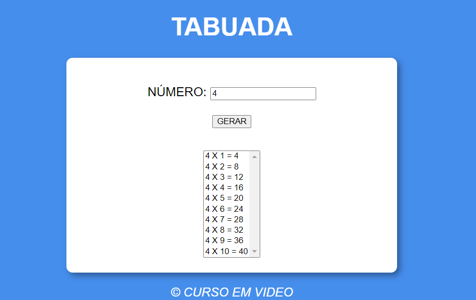

# TABUADA
👨‍🏫PROJETO FEITO PARA O CURSO DE JAVASCRIPT DO CURSO EM VIDEO.

  

## DESCRIÇÃO:
1. **Tabuada Interativa:**
   - O aplicativo gera a tabuada de um número fornecido pelo usuário.

2. **Entrada de Dados Simples:**
   - Um campo de entrada permite que o usuário insira o número para o qual deseja gerar a tabuada.

3. **Geração Automática:**
   - Ao clicar no botão "GERAR", a tabuada correspondente ao número inserido é gerada e exibida na área designada.

4. **Exibição Clara:**
   - A tabuada é exibida em uma lista suspensa, onde cada linha representa um cálculo da tabuada.

5. **Validação de Entrada:**
   - O aplicativo valida se o usuário forneceu um número antes de gerar a tabuada. Se nenhum número for fornecido, é exibida uma mensagem de erro.

## EXECUTANDO O PROJETO:
1. **Inserindo o Número:**
   - Digite o número para o qual você deseja gerar a tabuada no campo de entrada "NÚMERO".

2. **Gerando a Tabuada:**
   - Clique no botão "GERAR" para gerar a tabuada correspondente ao número inserido.

3. **Visualizando a Tabuada:**
   - A tabuada gerada será exibida na lista suspensa abaixo do campo de entrada.

4. **Explorando os Resultados:**
   - Você pode selecionar diferentes linhas na lista suspensa para visualizar os resultados de multiplicação correspondentes.

5. **Fornecendo Novos Números:**
   - Você pode inserir um novo número e gerar uma nova tabuada quantas vezes desejar.

## NÃO SABE?
- Entendemos que para manipular arquivos em `HTML`, `CSS` e outras linguagens relacionadas, é necessário possuir conhecimento nessas áreas. Para auxiliar nesse aprendizado, oferecemos cursos gratuitos disponíveis:
* [CURSO DE HTML E CSS](https://github.com/VILHALVA/CURSO-DE-HTML-E-CSS)
* [CURSO DE JAVASCRIPT](https://github.com/VILHALVA/CURSO-DE-JAVASCRIPT)
* [CONFIRA MAIS CURSOS](https://github.com/VILHALVA?tab=repositories&q=+topic:CURSO)

## CREDITOS:
- [PROJETO FEITO PELO VILHALVA](https://github.com/VILHALVA)
- [PROJETO FEITO PARA O CURSO DE JAVASCRIPT](https://github.com/VILHALVA/CURSO-DE-JAVASCRIPT)
